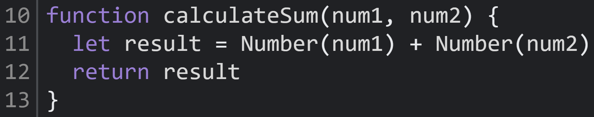

1. The bug is that the inputs `num1` and `num2` are strings, so the `+` operator results in a string concatenation.
2. The fix is converting the inputs `num1` and `num2` into numbers, so the `+` operator results in a number addition, resulting in the desired outcome of calculating the sum of the inputs.  
